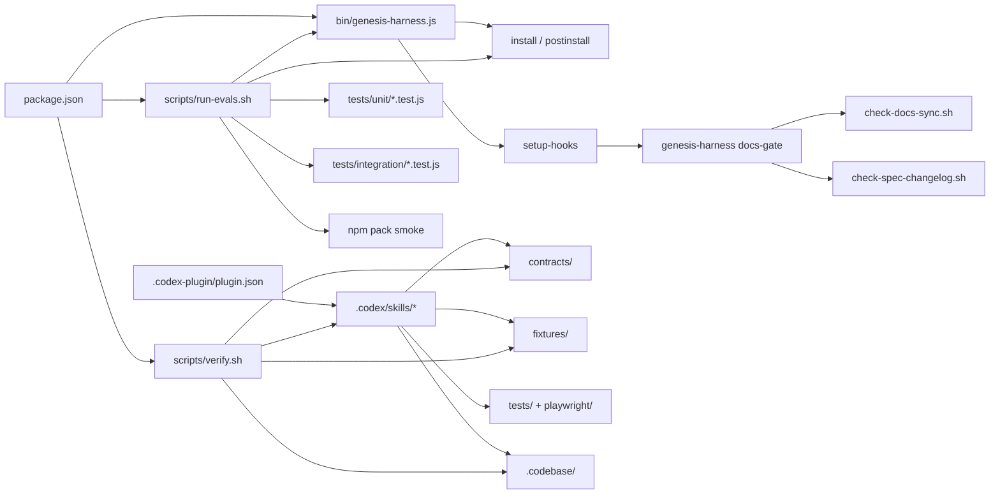
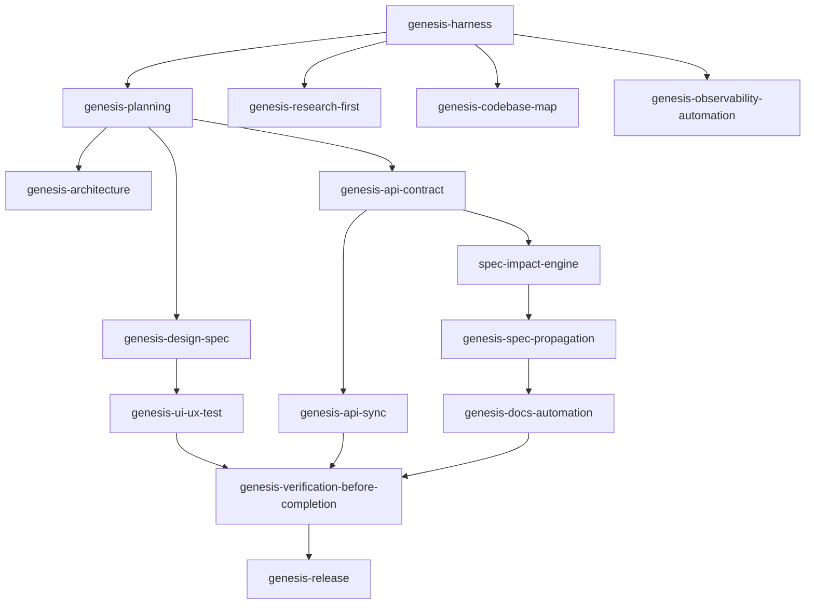
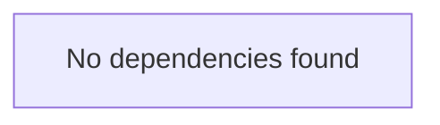
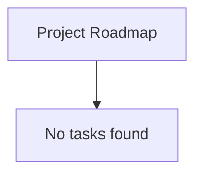

# Visual Project Graph

## Harness Relationship Map

```mermaid
flowchart LR
  manifest[".codex-plugin/plugin.json"] --> skills[".codex/skills/*"]
  package["package.json"] --> cli["bin/genesis-harness.js"]
  package --> verify["scripts/verify.sh"]
  package --> evals["scripts/run-evals.sh"]
  cli --> install["install / postinstall"]
  cli --> hooks["setup-hooks"]
  hooks --> docsgate["genesis-harness docs-gate"]
  docsgate --> docsync["check-docs-sync.sh"]
  docsgate --> specsync["check-spec-changelog.sh"]
  skills --> contracts["contracts/"]
  skills --> fixtures["fixtures/"]
  skills --> tests["tests/ + playwright/"]
  skills --> memory[".codebase/"]
  verify --> skills
  verify --> contracts
  verify --> fixtures
  verify --> memory
  evals --> install
  evals --> cli
  evals --> unit["tests/unit/*.test.js"]
  evals --> integration["tests/integration/*.test.js"]
  evals --> pack["npm pack smoke"]
```

## Skill Workflow Relationships

```mermaid
flowchart TD
  harness["genesis-harness"] --> planning["genesis-planning"]
  harness --> research["genesis-research-first"]
  planning --> architecture["genesis-architecture"]
  planning --> api["genesis-api-contract"]
  planning --> design["genesis-design-spec"]
  api --> apisync["genesis-api-sync"]
  design --> ui["genesis-ui-ux-test"]
  api --> specimpact["spec-impact-engine"]
  specimpact --> specprop["genesis-spec-propagation"]
  specprop --> docs["genesis-docs-automation"]
  ui --> verifybefore["genesis-verification-before-completion"]
  apisync --> verifybefore
  docs --> verifybefore
  verifybefore --> release["genesis-release"]
  harness --> memorymap["genesis-codebase-map"]
  harness --> observability["genesis-observability-automation"]
```

## Code Dependency Hints

```mermaid
flowchart TD
  Root["No dependencies found"]
```

## .planning/ROADMAP.md Derived Feature Status

```mermaid
graph TD
  classDef completed fill:#d4edda,stroke:#28a745,stroke-width:2px;
  classDef inprogress fill:#fff3cd,stroke:#ffc107,stroke-width:2px;
  classDef pending fill:#e2e3e5,stroke:#6c757d,stroke-width:2px;
  Project["Project Roadmap"] --> NoTasks["No tasks found"]
```

