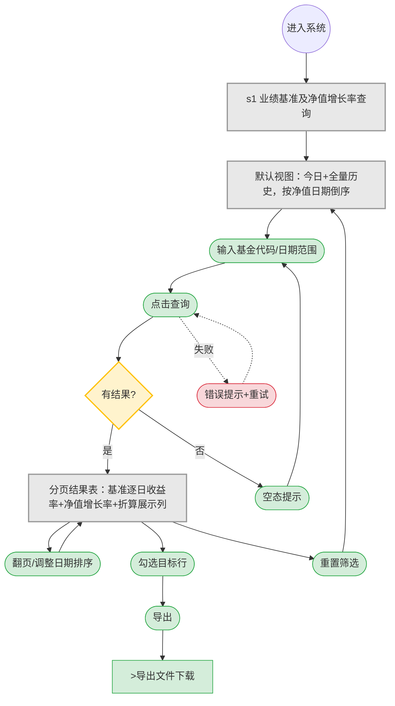

# UC-001 流程图 — 业绩基准及净值增长率查询

参与者：业务查看者（只读）。参见：`states.md`、`sequence.md`。

```mermaid
graph TD
    E((进入系统)) --> S1["s1 业绩基准及净值增长率查询"]
    S1 --> Dft["默认视图：今日+全量历史，按净值日期倒序"]
    Dft --> F([输入基金代码/日期范围])
    F --> Q([点击查询])
    Q --> Has{有结果?}
    Has -->|是| T["分页结果表：基准逐日收益率+净值增长率+折算展示列"]
    Has -->|否| Empty([空态提示])
    Empty --> F
    T --> Page([翻页/调整日期排序])
    Page --> T
    T --> Sel([勾选目标行])
    Sel --> Exp([导出])
    Exp --> Done[>导出文件下载]
    T --> Reset([重置筛选])
    Reset --> Dft
    Q -.->|失败| Err([错误提示+重试])
    Err -.-> Q

    classDef screen fill:#e8e8e8,stroke:#999,stroke-width:2px
    classDef modal fill:#e0e7ff,stroke:#6366f1,stroke-width:1px
    classDef decision fill:#fff3cd,stroke:#ffc107,stroke-width:2px
    classDef action fill:#d4edda,stroke:#28a745,stroke-width:1px
    classDef error fill:#f8d7da,stroke:#dc3545,stroke-width:1px
    class S1,Dft,T screen
    class Has decision
    class F,Q,Page,Sel,Exp,Done,Reset,Empty action
    class Err error
```
