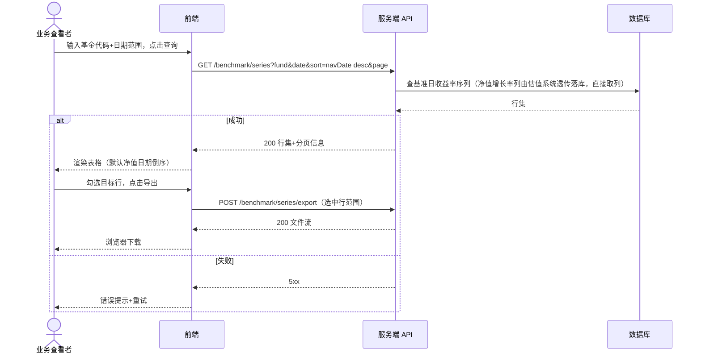

# UC-001 时序图 — 查询与导出

端点名为设计示意，以后端实际接口规格为准。

```mermaid
sequenceDiagram
    actor V as 业务查看者
    participant App as 前端
    participant API as 服务端 API
    participant DB as 数据库

    V->>App: 输入基金代码+日期范围，点击查询
    App->>API: GET /benchmark/series?fund&date&sort=navDate desc&page
    API->>DB: 查基准日收益率序列（净值增长率列由估值系统透传落库，直接取列）
    DB-->>API: 行集
    alt 成功
        API-->>App: 200 行集+分页信息
        App-->>V: 渲染表格（默认净值日期倒序）
        V->>App: 勾选目标行，点击导出
        App->>API: POST /benchmark/series/export（选中行范围）
        API-->>App: 200 文件流
        App-->>V: 浏览器下载
    else 失败
        API-->>App: 5xx
        App-->>V: 错误提示+重试
    end
```
