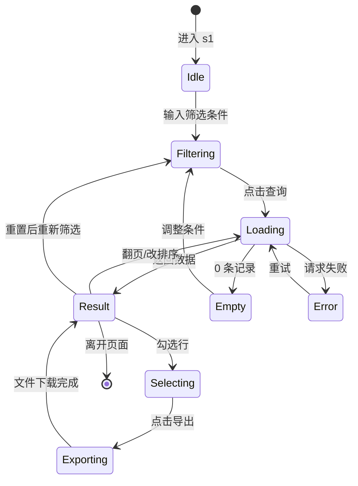

# UC-001 状态图 — 查询视图状态机

```mermaid
stateDiagram-v2
    [*] --> Idle: 进入 s1
    Idle --> Filtering: 输入筛选条件
    Filtering --> Loading: 点击查询
    Loading --> Result: 返回数据
    Loading --> Empty: 0 条记录
    Loading --> Error: 请求失败
    Error --> Loading: 重试
    Result --> Loading: 翻页/改排序
    Result --> Selecting: 勾选行
    Selecting --> Exporting: 点击导出
    Exporting --> Result: 文件下载完成
    Result --> Filtering: 重置后重新筛选
    Empty --> Filtering: 调整条件
    Result --> [*]: 离开页面
```

说明：`Result` 与 `Selecting` 为同一表格视图的两种交互态；导出仅在存在勾选行时可用。
