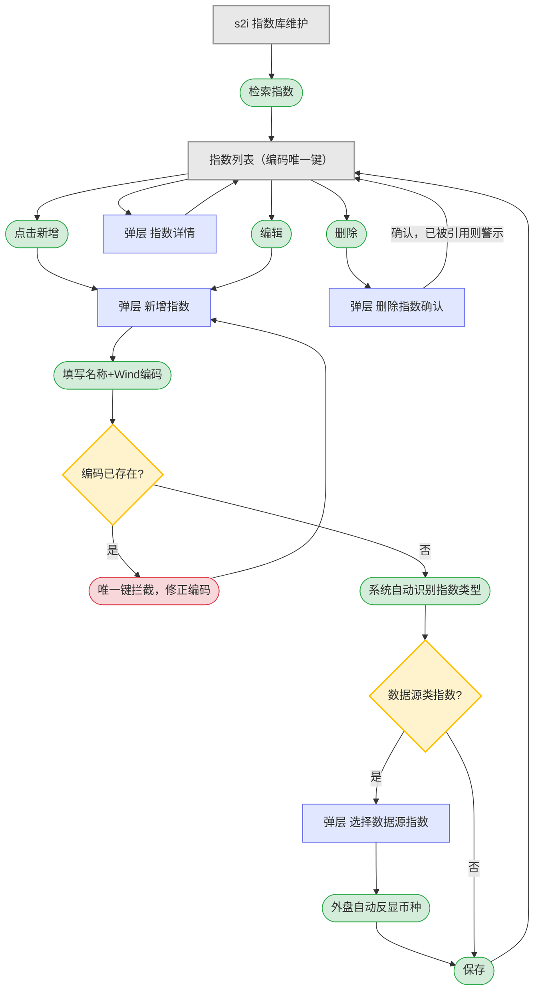

# UC-002 流程图 — 指数库维护

参与者：经办（投资风险部）。唯一键=指数编码（Wind 代码）；参见：`states.md`、`sequence.md`。

```mermaid
graph TD
    S["s2i 指数库维护"] --> Srch([检索指数])
    Srch --> L["指数列表（编码唯一键）"]
    L --> Add([点击新增])
    Add --> ZM["弹层 新增指数"]
    ZM --> Fill([填写名称+Wind编码])
    Fill --> Dup{编码已存在?}
    Dup -->|是| DupErr([唯一键拦截，修正编码])
    DupErr --> ZM
    Dup -->|否| AutoT([系统自动识别指数类型])
    AutoT --> IsSrc{数据源类指数?}
    IsSrc -->|是| SM["弹层 选择数据源指数"]
    SM --> Fx([外盘自动反显币种])
    Fx --> Save([保存])
    IsSrc -->|否| Save
    Save --> L
    L --> View["弹层 指数详情"]
    View --> L
    L --> Edit([编辑])
    Edit --> ZM
    L --> Del([删除])
    Del --> ZD["弹层 删除指数确认"]
    ZD -->|确认，已被引用则警示| L

    classDef screen fill:#e8e8e8,stroke:#999,stroke-width:2px
    classDef modal fill:#e0e7ff,stroke:#6366f1,stroke-width:1px
    classDef decision fill:#fff3cd,stroke:#ffc107,stroke-width:2px
    classDef action fill:#d4edda,stroke:#28a745,stroke-width:1px
    classDef error fill:#f8d7da,stroke:#dc3545,stroke-width:1px
    class S,L screen
    class ZM,SM,View,ZD modal
    class Dup,IsSrc decision
    class Srch,Add,Fill,AutoT,Fx,Save,Edit,Del action
    class DupErr error
```
