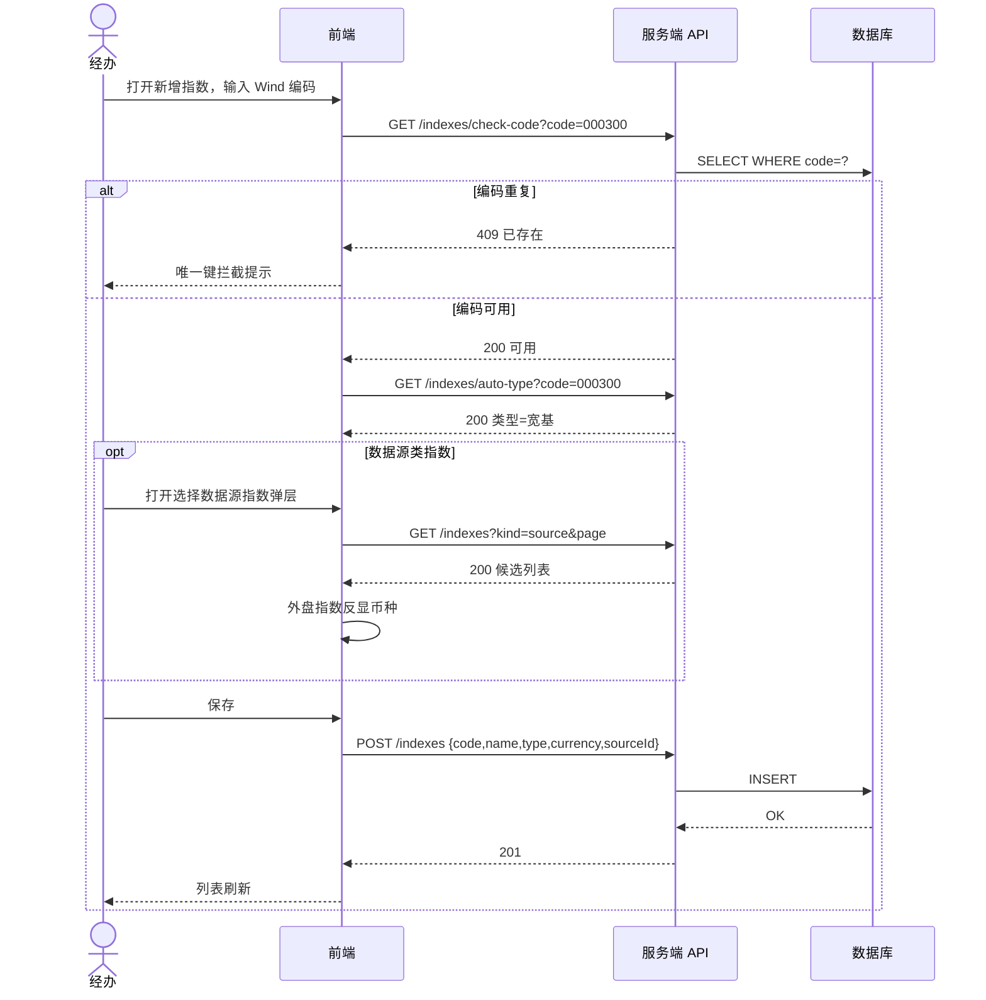

# UC-002 时序图 — 新增指数

端点名为设计示意。

```mermaid
sequenceDiagram
    actor OP as 经办
    participant App as 前端
    participant API as 服务端 API
    participant DB as 数据库

    OP->>App: 打开新增指数，输入 Wind 编码
    App->>API: GET /indexes/check-code?code=000300
    API->>DB: SELECT WHERE code=?
    alt 编码重复
        API-->>App: 409 已存在
        App-->>OP: 唯一键拦截提示
    else 编码可用
        API-->>App: 200 可用
        App->>API: GET /indexes/auto-type?code=000300
        API-->>App: 200 类型=宽基
        opt 数据源类指数
            OP->>App: 打开选择数据源指数弹层
            App->>API: GET /indexes?kind=source&page
            API-->>App: 200 候选列表
            App->>App: 外盘指数反显币种
        end
        OP->>App: 保存
        App->>API: POST /indexes {code,name,type,currency,sourceId}
        API->>DB: INSERT
        DB-->>API: OK
        API-->>App: 201
        App-->>OP: 列表刷新
    end
```
