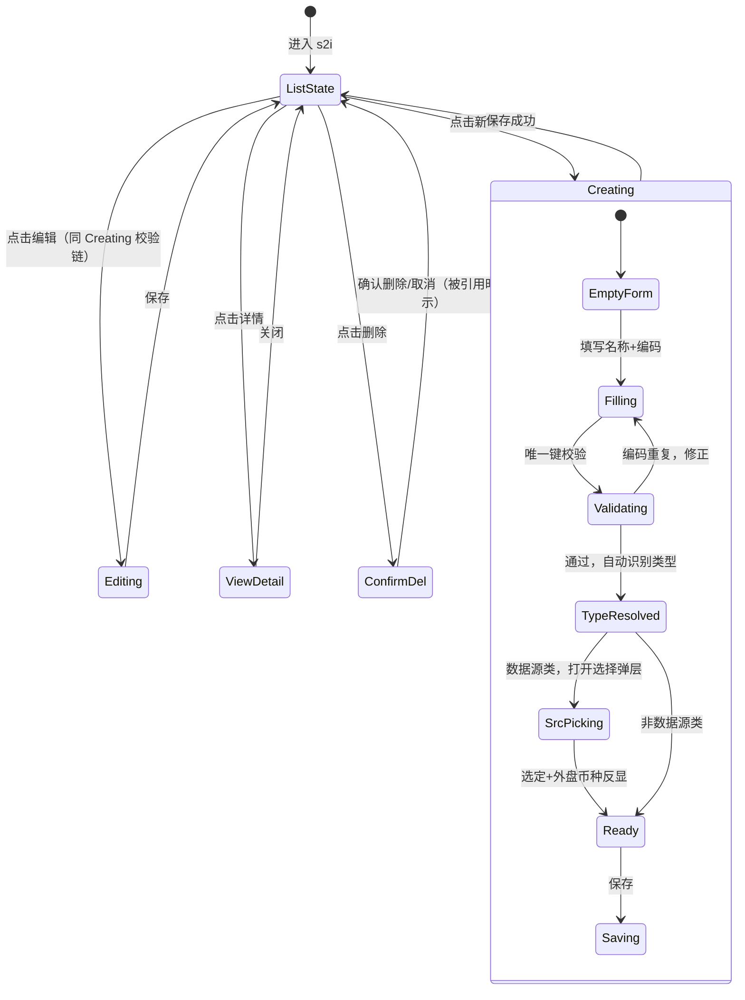

# UC-002 状态图 — 指数表单状态机

```mermaid
stateDiagram-v2
    [*] --> ListState: 进入 s2i
    ListState --> Creating: 点击新增

    state Creating {
        [*] --> EmptyForm
        EmptyForm --> Filling: 填写名称+编码
        Filling --> Validating: 唯一键校验
        Validating --> Filling: 编码重复，修正
        Validating --> TypeResolved: 通过，自动识别类型
        TypeResolved --> SrcPicking: 数据源类，打开选择弹层
        SrcPicking --> Ready: 选定+外盘币种反显
        TypeResolved --> Ready: 非数据源类
        Ready --> Saving: 保存
    }

    Creating --> ListState: 保存成功
    ListState --> Editing: 点击编辑（同 Creating 校验链）
    Editing --> ListState: 保存
    ListState --> ViewDetail: 点击详情
    ViewDetail --> ListState: 关闭
    ListState --> ConfirmDel: 点击删除
    ConfirmDel --> ListState: 确认删除/取消（被引用时警示）
```
