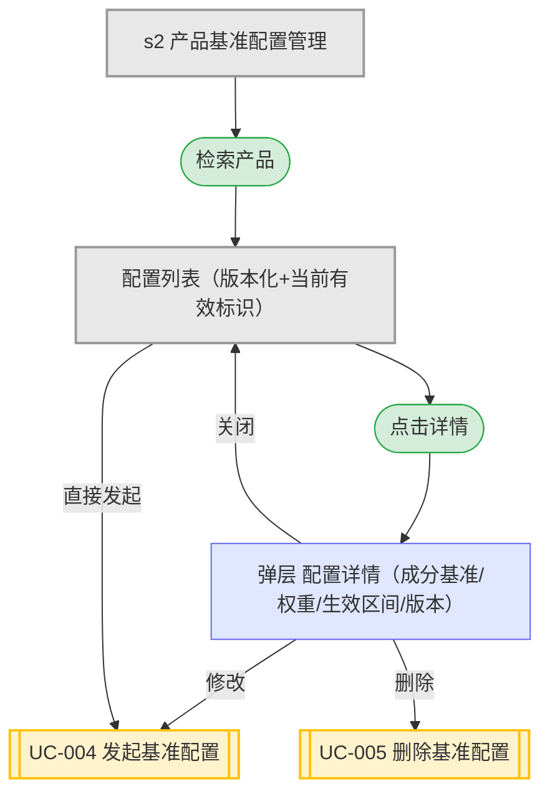

# UC-003 流程图 — 产品基准配置查询与详情

配置版本化（生效起止区间）；变更出口衔接 UC-004/005。

```mermaid
graph TD
    S["s2 产品基准配置管理"] --> Q([检索产品])
    Q --> L["配置列表（版本化+当前有效标识）"]
    L --> Dt([点击详情])
    Dt --> MC["弹层 配置详情（成分基准/权重/生效区间/版本）"]
    MC -->|关闭| L
    MC -->|修改| U4[[UC-004 发起基准配置]]
    MC -->|删除| U5[[UC-005 删除基准配置]]
    L -->|直接发起| U4

    classDef screen fill:#e8e8e8,stroke:#999,stroke-width:2px
    classDef modal fill:#e0e7ff,stroke:#6366f1,stroke-width:1px
    classDef decision fill:#fff3cd,stroke:#ffc107,stroke-width:2px
    classDef action fill:#d4edda,stroke:#28a745,stroke-width:1px
    classDef error fill:#f8d7da,stroke:#dc3545,stroke-width:1px
    class S,L screen
    class MC modal
    class Q,Dt action
    class U4,U5 decision
```
