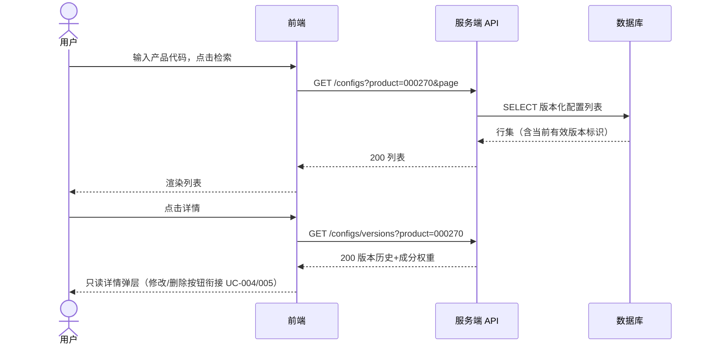

# UC-003 时序图 — 配置检索与详情

```mermaid
sequenceDiagram
    actor U as 用户
    participant App as 前端
    participant API as 服务端 API
    participant DB as 数据库

    U->>App: 输入产品代码，点击检索
    App->>API: GET /configs?product=000270&page
    API->>DB: SELECT 版本化配置列表
    DB-->>API: 行集（含当前有效版本标识）
    API-->>App: 200 列表
    App-->>U: 渲染列表
    U->>App: 点击详情
    App->>API: GET /configs/versions?product=000270
    API-->>App: 200 版本历史+成分权重
    App-->>U: 只读详情弹层（修改/删除按钮衔接 UC-004/005）
```
