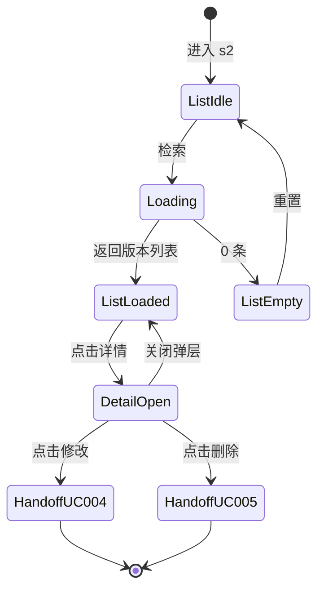

# UC-003 状态图 — 列表与详情

```mermaid
stateDiagram-v2
    [*] --> ListIdle: 进入 s2
    ListIdle --> Loading: 检索
    Loading --> ListLoaded: 返回版本列表
    Loading --> ListEmpty: 0 条
    ListEmpty --> ListIdle: 重置
    ListLoaded --> DetailOpen: 点击详情
    DetailOpen --> ListLoaded: 关闭弹层
    DetailOpen --> HandoffUC004: 点击修改
    DetailOpen --> HandoffUC005: 点击删除
    HandoffUC004 --> [*]
    HandoffUC005 --> [*]
```
