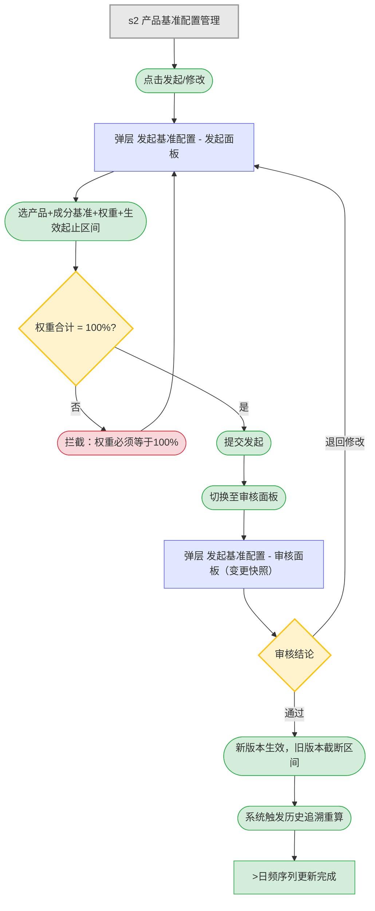

# UC-004 流程图 — 发起基准配置（经办→审核）

核心约束：成分权重合计必须 = 100%；审核通过后触发历史追溯重算。

```mermaid
graph TD
    S["s2 产品基准配置管理"] --> Open([点击发起/修改])
    Open --> MI["弹层 发起基准配置 - 发起面板"]
    MI --> Cfg([选产品+成分基准+权重+生效起止区间])
    Cfg --> W{权重合计 = 100%?}
    W -->|否| WErr([拦截：权重必须等于100%])
    WErr --> MI
    W -->|是| Sub([提交发起])
    Sub --> Sw([切换至审核面板])
    Sw --> MA["弹层 发起基准配置 - 审核面板（变更快照）"]
    MA --> D{审核结论}
    D -->|通过| Act([新版本生效，旧版本截断区间])
    Act --> Rc([系统触发历史追溯重算])
    Rc --> End[>日频序列更新完成]
    D -->|退回修改| MI

    classDef screen fill:#e8e8e8,stroke:#999,stroke-width:2px
    classDef modal fill:#e0e7ff,stroke:#6366f1,stroke-width:1px
    classDef decision fill:#fff3cd,stroke:#ffc107,stroke-width:2px
    classDef action fill:#d4edda,stroke:#28a745,stroke-width:1px
    classDef error fill:#f8d7da,stroke:#dc3545,stroke-width:1px
    class S screen
    class MI,MA modal
    class W,D decision
    class Open,Cfg,Sub,Sw,Act,Rc,End action
    class WErr error
```
