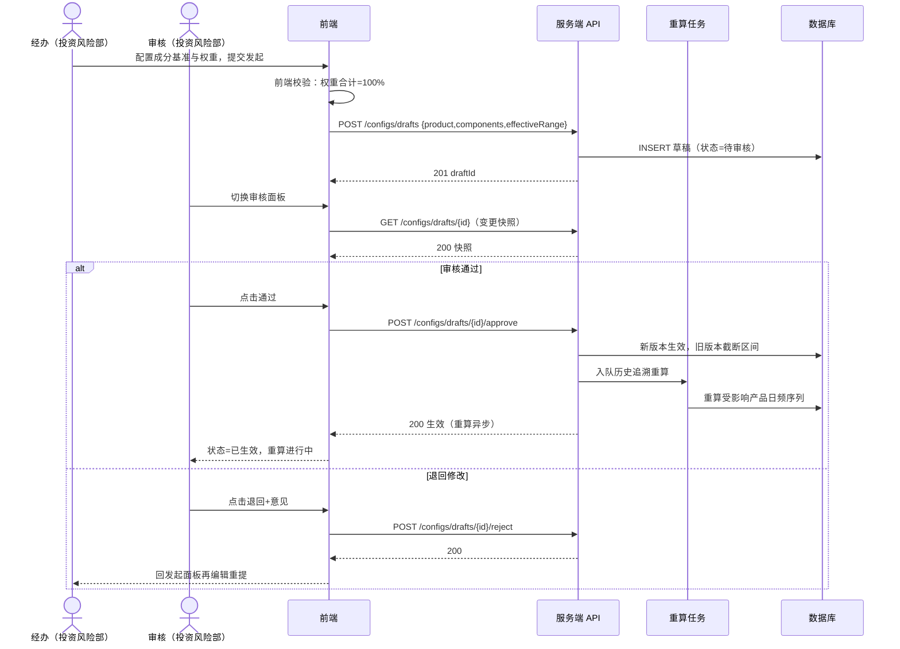

# UC-004 时序图 — 配置发起与审核

```mermaid
sequenceDiagram
    actor OP as 经办（投资风险部）
    actor RV as 审核（投资风险部）
    participant App as 前端
    participant API as 服务端 API
    participant JOB as 重算任务
    participant DB as 数据库

    OP->>App: 配置成分基准与权重，提交发起
    App->>App: 前端校验：权重合计=100%
    App->>API: POST /configs/drafts {product,components,effectiveRange}
    API->>DB: INSERT 草稿（状态=待审核）
    API-->>App: 201 draftId
    RV->>App: 切换审核面板
    App->>API: GET /configs/drafts/{id}（变更快照）
    API-->>App: 200 快照
    alt 审核通过
        RV->>App: 点击通过
        App->>API: POST /configs/drafts/{id}/approve
        API->>DB: 新版本生效，旧版本截断区间
        API->>JOB: 入队历史追溯重算
        JOB->>DB: 重算受影响产品日频序列
        API-->>App: 200 生效（重算异步）
        App-->>RV: 状态=已生效，重算进行中
    else 退回修改
        RV->>App: 点击退回+意见
        App->>API: POST /configs/drafts/{id}/reject
        API-->>App: 200
        App-->>OP: 回发起面板再编辑重提
    end
```
