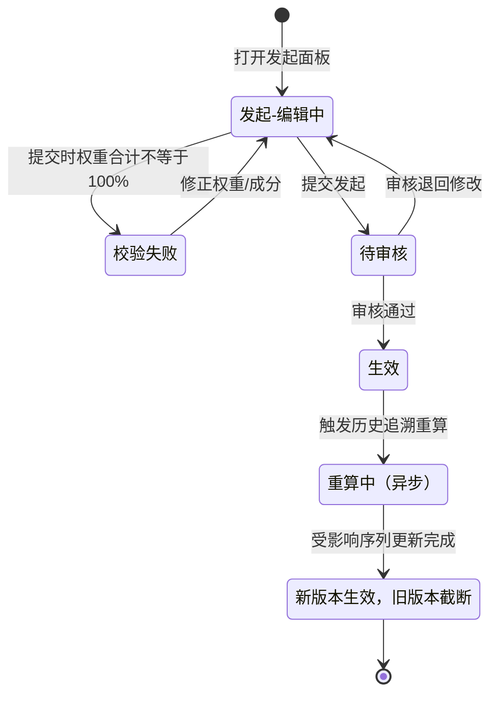

# UC-004 状态图 — 配置变更单生命周期

```mermaid
stateDiagram-v2
    [*] --> Editing: 打开发起面板
    Editing: 发起-编辑中
    Editing --> WeightFail: 提交时权重合计不等于100%
    WeightFail: 校验失败
    WeightFail --> Editing: 修正权重/成分
    Editing --> PendingAudit: 提交发起
    PendingAudit: 待审核
    PendingAudit --> Editing: 审核退回修改
    PendingAudit --> Approved: 审核通过
    Approved: 生效
    Approved --> Recalculating: 触发历史追溯重算
    Recalculating: 重算中（异步）
    Recalculating --> Active: 受影响序列更新完成
    Active: 新版本生效，旧版本截断
    Active --> [*]
```
