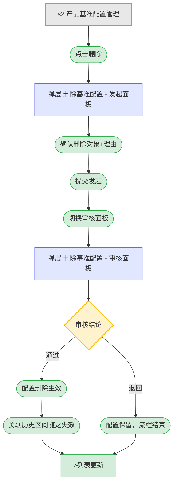

# UC-005 流程图 — 删除基准配置（经办→审核）

```mermaid
graph TD
    S["s2 产品基准配置管理"] --> Del([点击删除])
    Del --> MI["弹层 删除基准配置 - 发起面板"]
    MI --> Cfm([确认删除对象+理由])
    Cfm --> Sub([提交发起])
    Sub --> Sw([切换审核面板])
    Sw --> MA["弹层 删除基准配置 - 审核面板"]
    MA --> D{审核结论}
    D -->|通过| Done([配置删除生效])
    Done --> Rl([关联历史区间随之失效])
    D -->|退回| Keep([配置保留，流程结束])
    Rl --> End[>列表更新]
    Keep --> End

    classDef screen fill:#e8e8e8,stroke:#999,stroke-width:2px
    classDef modal fill:#e0e7ff,stroke:#6366f1,stroke-width:1px
    classDef decision fill:#fff3cd,stroke:#ffc107,stroke-width:2px
    classDef action fill:#d4edda,stroke:#28a745,stroke-width:1px
    classDef error fill:#f8d7da,stroke:#dc3545,stroke-width:1px
    class S screen
    class MI,MA modal
    class D decision
    class Del,Cfm,Sub,Sw,Done,Rl,Keep,End action
```
