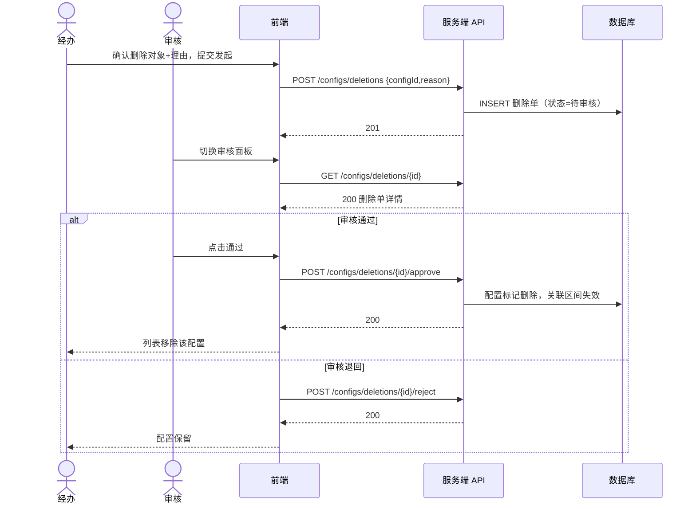

# UC-005 时序图 — 删除发起与审核

```mermaid
sequenceDiagram
    actor OP as 经办
    actor RV as 审核
    participant App as 前端
    participant API as 服务端 API
    participant DB as 数据库

    OP->>App: 确认删除对象+理由，提交发起
    App->>API: POST /configs/deletions {configId,reason}
    API->>DB: INSERT 删除单（状态=待审核）
    API-->>App: 201
    RV->>App: 切换审核面板
    App->>API: GET /configs/deletions/{id}
    API-->>App: 200 删除单详情
    alt 审核通过
        RV->>App: 点击通过
        App->>API: POST /configs/deletions/{id}/approve
        API->>DB: 配置标记删除，关联区间失效
        API-->>App: 200
        App-->>OP: 列表移除该配置
    else 审核退回
        App->>API: POST /configs/deletions/{id}/reject
        API-->>App: 200
        App-->>OP: 配置保留
    end
```
