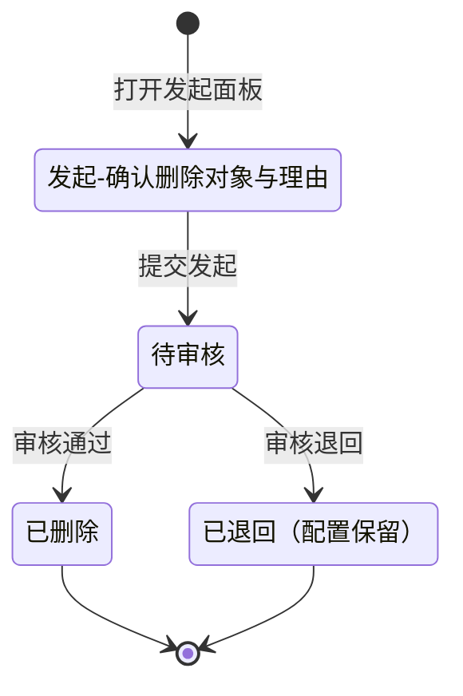

# UC-005 状态图 — 删除单生命周期

```mermaid
stateDiagram-v2
    [*] --> InitConfirm: 打开发起面板
    InitConfirm: 发起-确认删除对象与理由
    InitConfirm --> PendingAudit: 提交发起
    PendingAudit: 待审核
    PendingAudit --> Deleted: 审核通过
    Deleted: 已删除
    PendingAudit --> Rejected: 审核退回
    Rejected: 已退回（配置保留）
    Deleted --> [*]
    Rejected --> [*]
```
