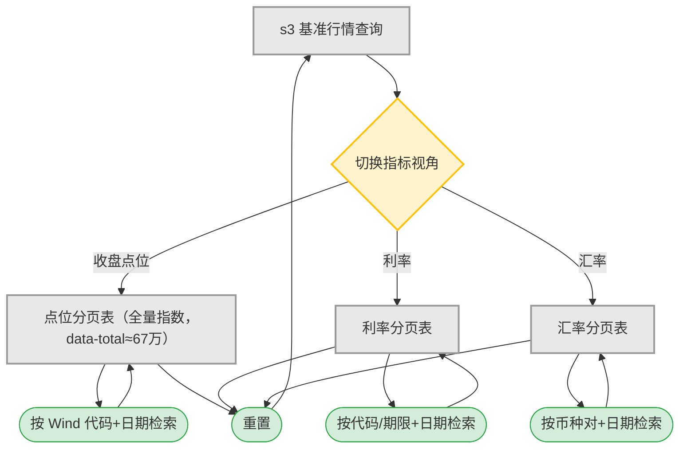

# UC-006 流程图 — 基准行情查询（只读）

三视角共享一套查询交互；Wind 代码唯一键。

```mermaid
graph TD
    S["s3 基准行情查询"] --> Tab{切换指标视角}
    Tab -->|收盘点位| P1["点位分页表（全量指数，data-total≈67万）"]
    Tab -->|利率| P2["利率分页表"]
    Tab -->|汇率| P3["汇率分页表"]
    P1 --> Q1([按 Wind 代码+日期检索])
    P2 --> Q2([按代码/期限+日期检索])
    P3 --> Q3([按币种对+日期检索])
    Q1 --> P1
    Q2 --> P2
    Q3 --> P3
    P1 --> R([重置])
    P2 --> R
    P3 --> R
    R --> S

    classDef screen fill:#e8e8e8,stroke:#999,stroke-width:2px
    classDef modal fill:#e0e7ff,stroke:#6366f1,stroke-width:1px
    classDef decision fill:#fff3cd,stroke:#ffc107,stroke-width:2px
    classDef action fill:#d4edda,stroke:#28a745,stroke-width:1px
    classDef error fill:#f8d7da,stroke:#dc3545,stroke-width:1px
    class S,P1,P2,P3 screen
    class Tab decision
    class Q1,Q2,Q3,R action
```
