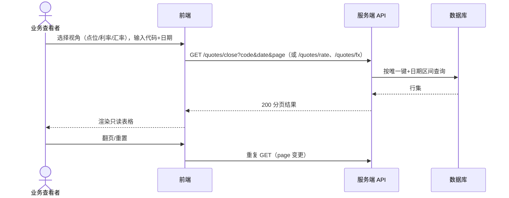

# UC-006 时序图 — 行情检索

```mermaid
sequenceDiagram
    actor V as 业务查看者
    participant App as 前端
    participant API as 服务端 API
    participant DB as 数据库

    V->>App: 选择视角（点位/利率/汇率），输入代码+日期
    App->>API: GET /quotes/close?code&date&page（或 /quotes/rate、/quotes/fx）
    API->>DB: 按唯一键+日期区间查询
    DB-->>API: 行集
    API-->>App: 200 分页结果
    App-->>V: 渲染只读表格
    V->>App: 翻页/重置
    App->>API: 重复 GET（page 变更）
```
