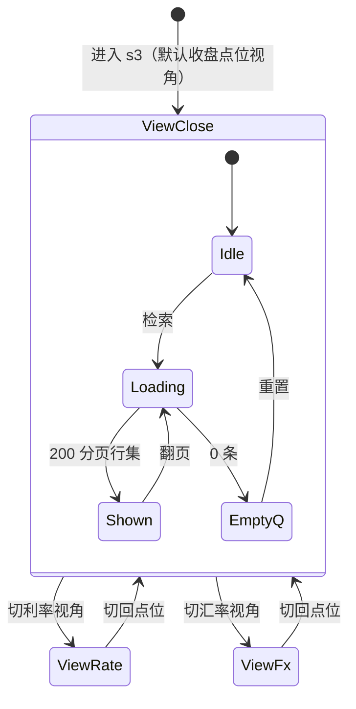

# UC-006 状态图 — 三视角查询状态机

```mermaid
stateDiagram-v2
    [*] --> ViewClose: 进入 s3（默认收盘点位视角）
    ViewClose --> ViewRate: 切利率视角
    ViewClose --> ViewFx: 切汇率视角
    ViewRate --> ViewClose: 切回点位
    ViewFx --> ViewClose: 切回点位

    state ViewClose {
        [*] --> Idle
        Idle --> Loading: 检索
        Loading --> Shown: 200 分页行集
        Loading --> EmptyQ: 0 条
        Shown --> Loading: 翻页
        EmptyQ --> Idle: 重置
    }
```

说明：`ViewRate`、`ViewFx` 内态与 `ViewClose` 相同（检索→加载→展示/空态），此处仅展开一个代表视角，避免重复。
