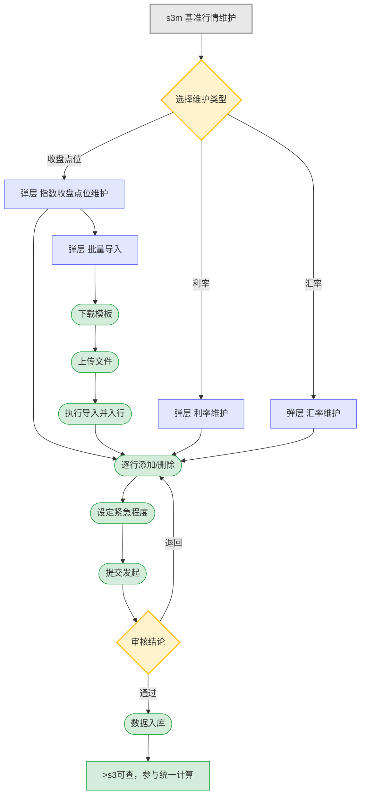

# UC-007 流程图 — 基准行情维护（经办→审核，含批量导入）

三类维护弹层共享一套「行编辑→紧急程度→发起→审核」骨架。

```mermaid
graph TD
    S["s3m 基准行情维护"] --> Pick{选择维护类型}
    Pick -->|收盘点位| MI["弹层 指数收盘点位维护"]
    Pick -->|利率| MR["弹层 利率维护"]
    Pick -->|汇率| MF["弹层 汇率维护"]
    MI --> Rows([逐行添加/删除])
    MR --> Rows
    MF --> Rows
    MI --> Imp["弹层 批量导入"]
    Imp --> Tpl([下载模板])
    Tpl --> Up([上传文件])
    Up --> Do([执行导入并入行])
    Do --> Rows
    Rows --> Urg([设定紧急程度])
    Urg --> Sub([提交发起])
    Sub --> D{审核结论}
    D -->|通过| St([数据入库])
    D -->|退回| Rows
    St --> End[>s3可查，参与统一计算]

    classDef screen fill:#e8e8e8,stroke:#999,stroke-width:2px
    classDef modal fill:#e0e7ff,stroke:#6366f1,stroke-width:1px
    classDef decision fill:#fff3cd,stroke:#ffc107,stroke-width:2px
    classDef action fill:#d4edda,stroke:#28a745,stroke-width:1px
    classDef error fill:#f8d7da,stroke:#dc3545,stroke-width:1px
    class S screen
    class MI,MR,MF,Imp modal
    class Pick,D decision
    class Rows,Tpl,Up,Do,Urg,Sub,St,End action
```
