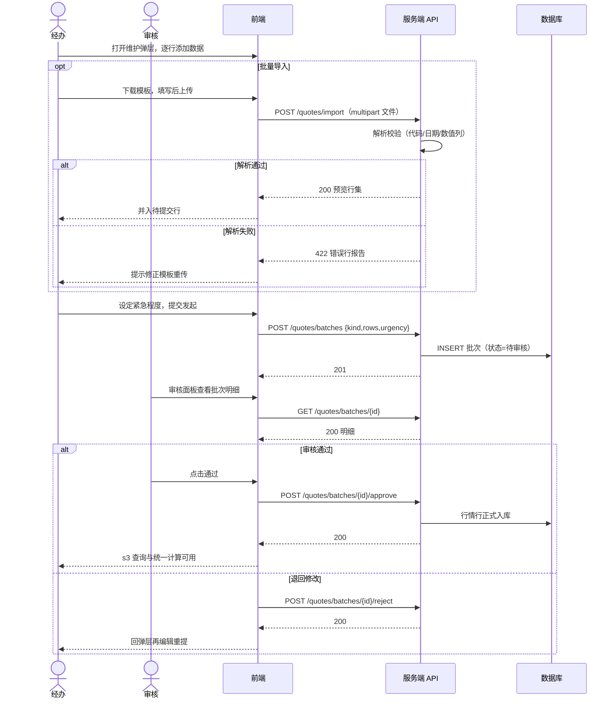

# UC-007 时序图 — 行编辑、批量导入与审核

```mermaid
sequenceDiagram
    actor OP as 经办
    actor RV as 审核
    participant App as 前端
    participant API as 服务端 API
    participant DB as 数据库

    OP->>App: 打开维护弹层，逐行添加数据
    opt 批量导入
        OP->>App: 下载模板，填写后上传
        App->>API: POST /quotes/import（multipart 文件）
        API->>API: 解析校验（代码/日期/数值列）
        alt 解析通过
            API-->>App: 200 预览行集
            App-->>OP: 并入待提交行
        else 解析失败
            API-->>App: 422 错误行报告
            App-->>OP: 提示修正模板重传
        end
    end
    OP->>App: 设定紧急程度，提交发起
    App->>API: POST /quotes/batches {kind,rows,urgency}
    API->>DB: INSERT 批次（状态=待审核）
    API-->>App: 201
    RV->>App: 审核面板查看批次明细
    App->>API: GET /quotes/batches/{id}
    API-->>App: 200 明细
    alt 审核通过
        RV->>App: 点击通过
        App->>API: POST /quotes/batches/{id}/approve
        API->>DB: 行情行正式入库
        API-->>App: 200
        App-->>OP: s3 查询与统一计算可用
    else 退回修改
        App->>API: POST /quotes/batches/{id}/reject
        API-->>App: 200
        App-->>OP: 回弹层再编辑重提
    end
```
