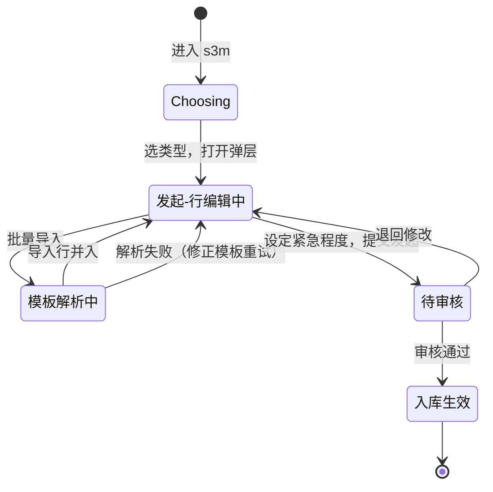

# UC-007 状态图 — 行情维护单生命周期

```mermaid
stateDiagram-v2
    [*] --> Choosing: 进入 s3m
    Choosing --> RowEditing: 选类型，打开弹层
    RowEditing: 发起-行编辑中
    RowEditing --> Importing: 批量导入
    Importing: 模板解析中
    Importing --> RowEditing: 导入行并入
    Importing --> RowEditing: 解析失败（修正模板重试）
    RowEditing --> PendingAudit: 设定紧急程度，提交发起
    PendingAudit: 待审核
    PendingAudit --> Approved: 审核通过
    Approved: 入库生效
    PendingAudit --> RowEditing: 退回修改
    Approved --> [*]
```
